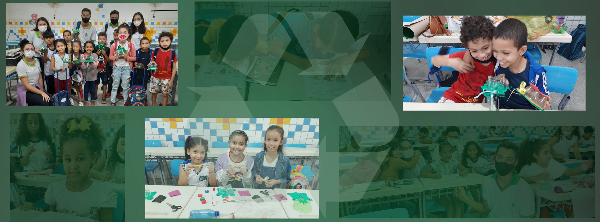

# Projeto_TSMA
Projeto: "Tecnologia a serviço do meio ambiente: Trabalhando a sustentabilidade no Ensino Fundamental".

## Apresentação

O projeto de extensão Tecnologia a serviço do meio ambiente: trabalhando a sustentabilidade no ensino fundamental teve por objetivo ensinar sobre a sustentabilidade para estudantes do 2º ano do Ensino Fundamental (anos iniciais) da rede municipal de ensino de Arapiraca, de modo que, após entenderem a importância de se preservar o meio ambiente, desenvolvam e conservem hábitos sustentáveis na busca por uma melhor qualidade de vida e de um mundo ecologicamente correto.

Ao longo do projeto, registramos as experiências mais divertidas trabalhando em conjunto com os discentes, observado na parte de oficinas do site em que há o registro fotográfico e descrito do que ocorreu. Como forma de acolher o público docente e familiar, acrescentamos uma parte de tutoriais para que posteriormente, nosso projeto possa servir de inspiração para futuras ações, ajudando professores e pais que queiram integrar a sustentabilidade nas aulas e práticas do dia a dia de seus pequenos. Para isso, usamos os meios tecnológicos disponíveis no mundo atual, mostrando que sustentabilidade e tecnologia não só podem, mas devem andar juntas.

## Sustentabilidade

Em um mundo individualista, regido por uma acentuada cultura de consumo, hábitos sustentáveis surgem na busca pelo equilíbrio entre a disponibilidade de recursos naturais e a exploração dos mesmos pela sociedade. Apesar de muito se ouvir falar sobre sustentabilidade, seus fins nem sempre são compreendidos. Categoricamente, alcança-se a sustentabilidade através de um desenvolvimento social, ambiental e economicamente sustentável, que, por sua vez, busca satisfazer as necessidades da geração presente sem comprometer o abastecimento de recursos para a próxima geração. O despertar de uma consciência social acerca do aprimoramento desse desenvolvimento sustentável começa a ser trabalhado com a incorporação e a prática diária de pequenas ações.

Evitar o uso de sacolas plásticas, economizar água e energia elétrica, são algumas ações que exemplificam, de maneira simples, como a sustentabilidade pode ser incluída rotineiramente na vida da sociedade, desmistificando e tornando mais acessível a sua execução. Dessa forma, a educação ambiental torna-se uma ferramenta essencial para a construção de um mundo ecologicamente correto. Foi nesse cenário, que o projeto Tecnologia a serviço do meio ambiente buscou promover a propagação do pensamento sustentável ainda nos anos iniciais, através de informação, reutilização e coletividade. Já que, para que possa haver um desenvolvimento sustentável, primeiro é preciso existir um desenvolvimento humano, reaproximando o homem da natureza.

## Considerações finais

O projeto obteve grande êxito na realização das atividades propostas, conseguimos auxiliar a escola na educação ambiental e ampliando o conhecimento das crianças sobre o assunto. E com isso, mudando o comportamento das mesmas, desenvolvendo a consciência ambiental e amor pela natureza. Ademais, foi notória a enorme alegria das crianças no desenvolvimento das oficinas e envolvimento nas questões que envolvem sustentabilidade.

Fica aqui também o nosso agradecimento à equipe diretiva da escola Professora Maria Cleonice, a Diretora Maria Zilda Fernandes da Silva; Vice-diretora Erivânia Nunes dos Santos e a Coordenadora Eliana de Oliveira Lima, assim como aos professores, Maria José Ribeiro Silva e Celso de Farias Lima, e a todos os demais funcionários pelo acolhimento e ajuda na realização das atividades, sem eles o projeto não teria obtido tanto êxito.

